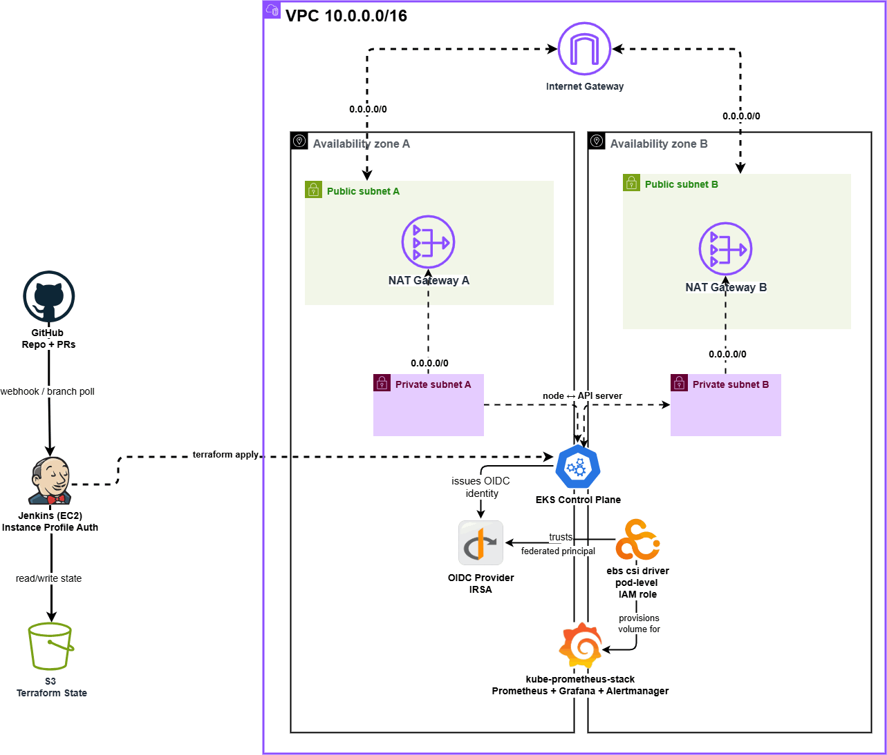

# EKS Platform Core + Jenkins Pipeline

A Terraform-managed EKS cluster with an integrated observability stack (Prometheus + Grafana), deployed and operated through a Jenkins pipeline enforcing plan-review-apply discipline instead of manual CLI runs.

## Architecture

- **Networking**: VPC across 2 AZs, public/private subnets, 2 independent NAT Gateways (one per AZ, no shared single point of failure)
- **Compute**: EKS cluster + managed node group, least-privilege IAM roles throughout (no `AdministratorAccess` anywhere)
- **Observability**: kube-prometheus-stack (Prometheus, Grafana, Alertmanager) via Terraform's `helm_release`, persisted on `gp3` EBS volumes via an IRSA-authenticated CSI driver
- **CI/CD**: Jenkins on EC2 (instance-profile authenticated, no static AWS keys), pipeline stages: **Lint → Plan → PR comment → Manual Approval → Apply → Rollout verification**



## Stack

Terraform · AWS (VPC, EKS, IAM, EC2) · Helm · Jenkins · Prometheus/Grafana

## Repo layout

```
bootstrap/          # one-time S3 state backend, local state
environments/dev/   # root module wiring vpc, eks, addons, jenkins
modules/
  vpc/               # networking
  eks/               # cluster, node group, IAM, OIDC
  addons/            # Helm release, EBS CSI driver (IRSA), StorageClass
  jenkins/           # Jenkins EC2, IAM role, security group
Jenkinsfile

```

## Notable design decisions

- **Two NAT Gateways, not one** - each AZ's private subnet routes through its own NAT, so no single AZ failure takes down outbound connectivity cluster-wide.
- **IRSA for the EBS CSI driver** - pod-level IAM identity via OIDC, not the node's IAM role, so only the CSI driver's specific service account can manage volumes, not every pod on the node.
- **Helm values live in Terraform, not the pipeline** - `helm_release` owns the single source of truth for chart values; the Jenkinsfile's post-apply stage verifies rollout health rather than re-running `helm upgrade` with a separate config path.
- `terraform apply` **runs against a saved plan file, not a fresh plan** - guarantees what a human approved is exactly what gets applied, with no drift in between.

## Known environment quirks

- Jenkins' apt signing key rotates (`jenkins.io-2026.key` as of this writing) - check `https://pkg.jenkins.io/debian-stable/` if the install step starts failing GPG verification.

## Running it

```bash
cd bootstrap && terraform init && terraform apply   # one-time, state backend
cd ../environments/dev && terraform init && terraform apply

```

Jenkins pipeline runs automatically on push via a Multibranch Pipeline job pointed at this repo.

## Documentation

Full setup guide, architecture decisions, and redeployment walkthrough:

[EKS Platform Core + Jenkins Pipeline](https://polarized-boater-990.notion.site/EKS-Platform-Core-Jenkins-Pipeline-Step-by-Step-Walkthrough-3d2604d0a689807eb5b3c82eb670beb0)

## Author

**Kazeem**
